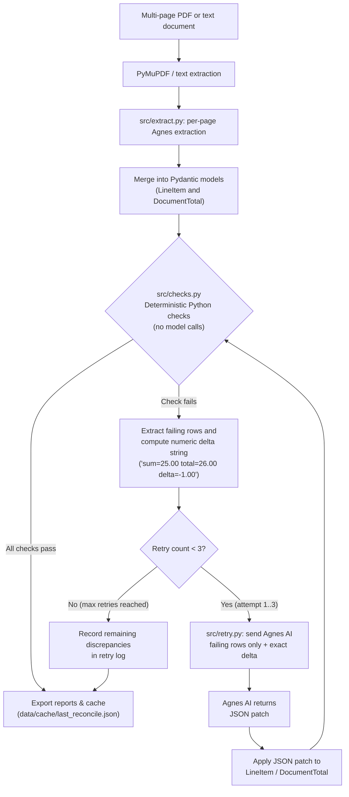

# System architecture: Option B loop

## Overview

Doc Reconciler separates text extraction from mathematical validation. Language models parse raw document text into structured records, while Python runs all arithmetic and consistency checks. Python owns the math.

The reconciliation cycle follows four steps:
1. Agnes AI extracts line items and page totals from unstructured PDF or text into Pydantic models.
2. Python executes arithmetic checks, summation, tolerance evaluation, and consistency rules without calling the model.
3. If any check fails, Python calculates the exact numeric difference (such as `sum=12.40 total=13.00 delta=-0.60`) and sends only the failing rows back to Agnes AI requesting a JSON patch.
4. Python applies the patch and re-evaluates the checks, repeating up to three times until all checks pass or retries are exhausted. State and retry audit records are persisted in `data/cache/last_reconcile.json`.

## Option B loop diagram

## Component responsibilities

| Component | Responsibility | Model calls |
|---|---|---|
| [`src/pdf_processor.py`](file:///D:/AI/Github/doc-reconciler/src/pdf_processor.py) | Reads multi-page PDFs, extracts text per page, renders page images for the UI. | None |
| [`src/agnes_client.py`](file:///D:/AI/Github/doc-reconciler/src/agnes_client.py) | Configures Agnes AI client with `AGNESAI_API_KEY` and handles provider detection. | None |
| [`src/extract.py`](file:///D:/AI/Github/doc-reconciler/src/extract.py) | Prompts Agnes AI (`agnes-3.0-flash`) with a JSON schema for line items and totals, then merges pages. Supports PDF and text. | `agnes-3.0-flash` |
| [`src/models.py`](file:///D:/AI/Github/doc-reconciler/src/models.py) | Defines Pydantic schemas: [`LineItem`](file:///D:/AI/Github/doc-reconciler/src/models.py#L10), [`DocumentTotal`](file:///D:/AI/Github/doc-reconciler/src/models.py#L22), [`CheckResult`](file:///D:/AI/Github/doc-reconciler/src/models.py#L38), and [`RetryLogEntry`](file:///D:/AI/Github/doc-reconciler/src/models.py#L71). | None |
| [`src/checks.py`](file:///D:/AI/Github/doc-reconciler/src/checks.py) | Checks sum vs total, line item multiplication, duplicate rows, and page-1 vs last-page totals. Returns `list[CheckResult]`. | None |
| [`src/retry.py`](file:///D:/AI/Github/doc-reconciler/src/retry.py) | Collects failing rows, sends them with numeric delta strings to Agnes AI, applies returned JSON patches, retries up to three times, and writes `data/cache/last_reconcile.json`. | `agnes-3.0-flash` |
| [`app.py`](file:///D:/AI/Github/doc-reconciler/app.py) | Streamlit dashboard across five tabs: Upload, Line items, Checks, Retry log, and Export. | None |

## Option comparison

| Dimension | Option A (model self-check) | Option B (Python checks) |
|---|---|---|
| Arithmetic check | Model evaluates own arithmetic, risking repeated calculation mistakes. | Deterministic floating-point arithmetic with configurable tolerance. |
| Token usage | Resends full document text on each retry. | Sends only failing rows and computed error strings. |
| Audit trail | Model changes values without explicit numerical basis. | Records exact numerical delta and received patch on each attempt. |
| Verification time | Requires model latency for every check. | Executes in Python sub-millisecond before any retry call. |
